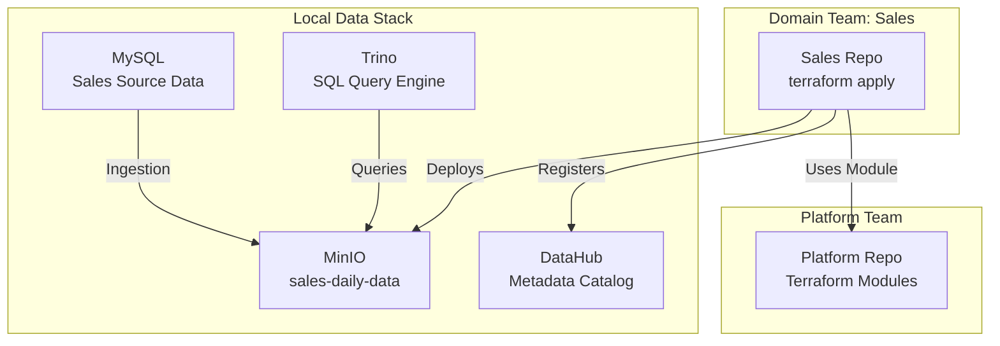

```mermaid
graph TB
  subgraph "Platform Team"
    direction TB
    P[Platform Repo<br/>Terraform Modules]
  end

  subgraph "Domain Team: Sales"
    direction TB
    D[Sales Repo<br/>terraform apply]
  end

  subgraph "Local Data Stack"
    MinIO[MinIO<br/>sales-daily-data]
    Trino[Trino<br/>SQL Query Engine]
    DataHub[DataHub<br/>Metadata Catalog]
    MySQL[MySQL<br/>Sales Source Data]
  end

  D -- "Uses Module" --> P
  D -- "Deploys" --> MinIO
  D -- "Registers" --> DataHub
  Trino -- "Queries" --> MinIO
  MySQL -- "Ingestion" --> MinIO
```