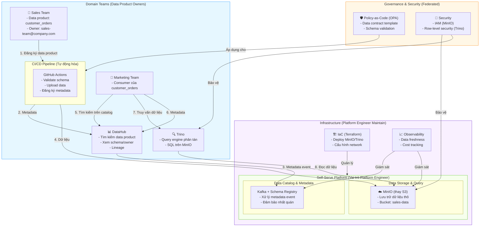

```mermaid
flowchart TD
    %% =============== LỚP 1: DOMAIN TEAMS (SỞ HỮU DỮ LIỆU) ===============
    subgraph Domain_Teams["Domain Teams (Data Product Owners)"]
        direction TB
        Sales["🛒 Sales Team\n- Data product: customer_orders\n- Owner: sales-team@company.com"]
        Marketing["🎯 Marketing Team\n- Consumer của customer_orders"]
        
        Sales -->|1. Đăng ký data product| CI_CD
        Marketing -->|5. Tìm kiếm trên catalog| DataHub
        Marketing -->|7. Truy vấn dữ liệu| Trino
    end

    %% =============== LỚP 2: SELF-SERVE PLATFORM (PLATFORM ENGINEER XÂY DỰNG) ===============
    subgraph Platform["Self-Serve Platform (Vai trò Platform Engineer)"]
        direction TB
        
        subgraph CI_CD["CI/CD Pipeline (Tự động hóa)"]
            GitHub["GitHub Actions\n- Validate schema\n- Upload data\n- Đăng ký metadata"]
        end
        
        subgraph Data_Catalog["Data Catalog & Metadata"]
            DataHub["📊 DataHub\n- Tìm kiếm data product\n- Xem schema/owner\n- Lineage"]
            Kafka[" Kafka + Schema Registry\n- Xử lý metadata event\n- Đảm bảo nhất quán"]
        end
        
        subgraph Data_Storage["Data Storage & Query"]
            MinIO["☁️ MinIO (thay S3)\n- Lưu trữ dữ liệu thô\n- Bucket: sales-data"]
            Trino["🔍 Trino\n- Query engine phân tán\n- SQL trên MinIO"]
        end
        
        CI_CD -->|2. Metadata| DataHub
        DataHub -->|3. Metadata event| Kafka
        CI_CD -->|4. Dữ liệu| MinIO
        Marketing -->|6. Metadata| DataHub
        Trino -->|8. Đọc dữ liệu| MinIO
    end

    %% =============== LỚP 3: GOVERNANCE & SECURITY ===============
    subgraph Governance["Governance & Security (Federated)"]
        Policy["🛡️ Policy-as-Code (OPA)\n- Data contract template\n- Schema validation"]
        Security["🔐 Security\n- IAM (MinIO)\n- Row-level security (Trino)"]
        
        Policy -->|Áp dụng cho| CI_CD
        Security -->|Bảo vệ| MinIO
        Security -->|Bảo vệ| Trino
    end

    %% =============== LỚP 4: INFRASTRUCTURE (PLATFORM ENGINEER QUẢN LÝ) ===============
    subgraph Infrastructure["Infrastructure (Platform Engineer Maintain)"]
        IaC["🏗️ IaC (Terraform)\n- Deploy MinIO/Trino\n- Cấu hình network"]
        Monitoring["📈 Observability\n- Data freshness\n- Cost tracking"]
        
        IaC -->|Quản lý| Platform
        Monitoring -->|Giám sát| Kafka
        Monitoring -->|Giám sát| MinIO
    end

    %% =============== KẾT NỐI CÁC LỚP ===============
    classDef domain fill:#e6f7ff,stroke:#1890ff;
    classDef platform fill:#f6ffed,stroke:#52c41a;
    classDef governance fill:#fff7e6,stroke:#fa8c16;
    classDef infra fill:#f9f0ff,stroke:#722ed1;
    
    class Domain_Teams domain;
    class Platform platform;
    class Governance governance;
    class Infrastructure infra;
```